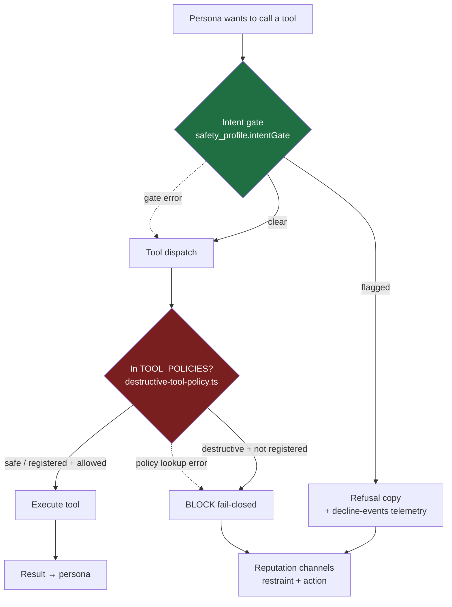
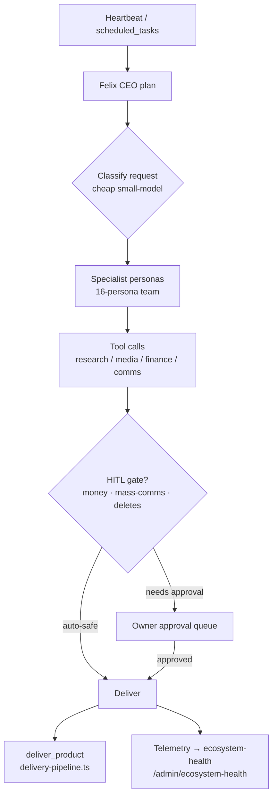
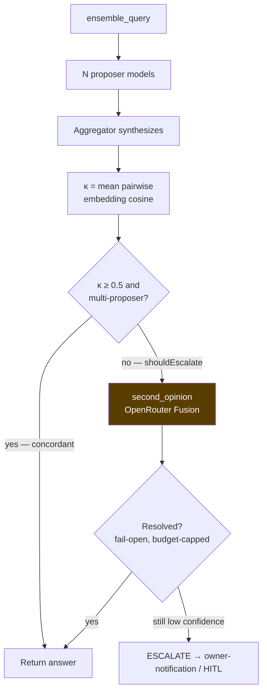
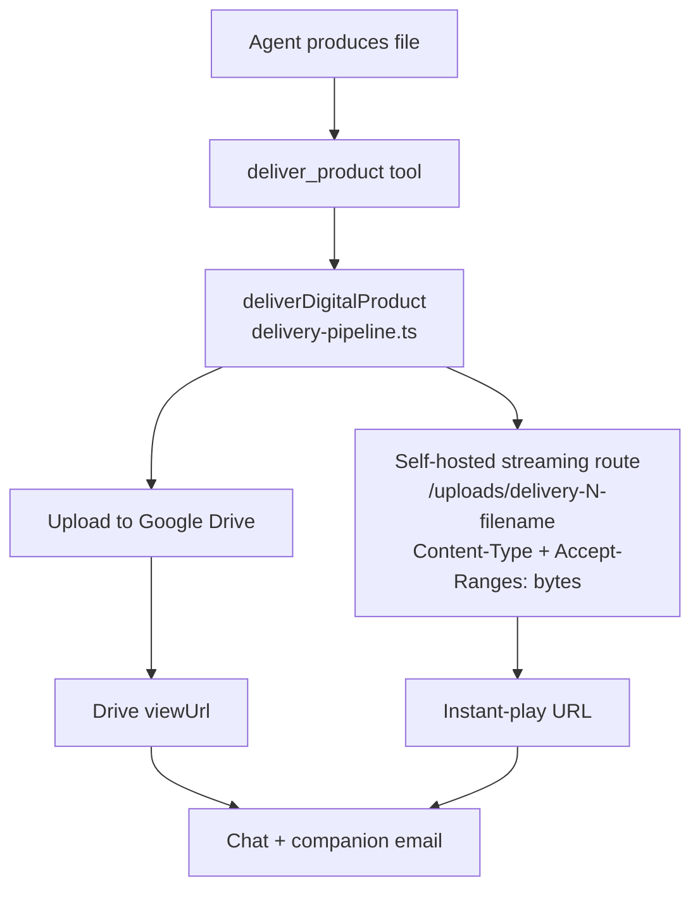
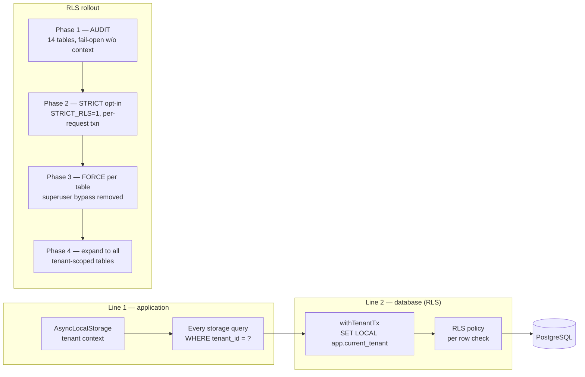

# VisionClaw Architecture Diagrams

Visual companion to `README.md`, `docs/SECURITY_ARCHITECTURE.md`, and
`docs/architecture-notes.md`. These Mermaid diagrams render natively on GitHub.
They document the **core runtime flows** so a new contributor can build a mental
model before reading 200k lines of TypeScript.

> Source of truth is always the code. If a diagram drifts from
> `server/chat-engine.ts`, `server/moa.ts`, `server/safety/`, or
> `server/delivery-pipeline.ts`, the code wins — fix the diagram.

---

## 1. Request lifecycle (HTTP → tenant-scoped data)

Every authenticated API request is wrapped in a tenant context before it ever
touches storage. Public surfaces (landing pages, health checks) take an explicit
no-context bypass.

```mermaid
flowchart TD
    A[Client / React SPA] -->|"x-csrf-token + session cookie"| B[Express]
    B --> C[Helmet security headers]
    C --> D[CSRF middleware<br/>/api global, skip-list]
    D --> E{Authenticated<br/>tenant?}
    E -->|"yes"| F[AsyncLocalStorage<br/>tenant context]
    E -->|"public route"| G[no-context bypass]
    F --> H[Route handler<br/>server/routes/*.ts]
    G --> H
    H --> I[Storage layer<br/>WHERE tenant_id = ?]
    I --> J[(PostgreSQL + pgvector)]
    J -->|"RLS second line of defense"| I
    H --> K[Global error middleware<br/>server/index.ts]
```

---

## 2. AHB safety layer (intent gate + destructive-tool policy)

The Adversarial-Hardening-Baseline layer is non-negotiable. The two gates fail
in **opposite** directions on purpose: the intent gate fails OPEN (never blocks
legitimate work, but logs loud), while the destructive-tool policy fails CLOSED
(an unregistered destructive tool is refused, not allowed).

- **Fail-OPEN (green):** intent gate — logged loudly, never silently swallows.
- **Fail-CLOSED (red):** destructive-tool policy — default for an unregistered
  destructive tool is refusal.

---

## 3. Felix autonomous loop (the "AI Corporation" heartbeat)

Felix (the CEO persona) drives autonomous corporate ops. Work originates from
the heartbeat / scheduled tasks, is planned, delegated to specialist personas,
and gated by HITL before anything irreversible ships.

---

## 4. MoA jury, κ concordance & Fusion second-opinion escalation

`ensemble_query` is the default for any "thinking" prompt. Multiple proposer
models answer; concordance (κ = mean pairwise embedding cosine) decides whether
the answer is trustworthy or should escalate. Low confidence auto-fires a Fusion
cross-check **before** burning a human.

- `second_opinion` runs under a dedicated owner-only daily Fusion cap
  (atomic reserve-then-settle) and **never throws** — it fails open and is
  latency-bounded by a hard timeout.

---

## 5. Delivery pipeline (instant-play, Drive-lag-proof)

All human-facing file deliveries — for customers **and** the owner — go through
`deliverDigitalProduct()`. Direct `uploadToDrive()` calls are forbidden because
Drive's mobile app fakes "still processing" indefinitely on valid MP4s.

---

## 6. Tenant isolation — defense in depth (app layer + RLS phases)

Tenant isolation has two independent lines of defense. The app layer is the
first; Postgres Row-Level Security is the second, so a future code edit that
drops a `WHERE` clause still cannot leak cross-tenant rows. RLS is being rolled
out in staged phases (see `docs/rls-rollout-plan.md`).

---

## Maintenance

These diagrams are documentation, not generated artifacts. When a core flow
changes, update the matching diagram in the same PR. For the request/route map,
the authoritative list of mounted routers lives in `server/routes/`.
